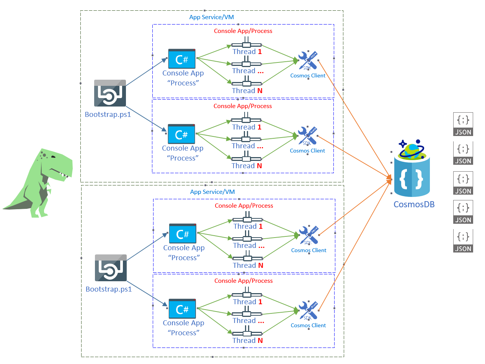
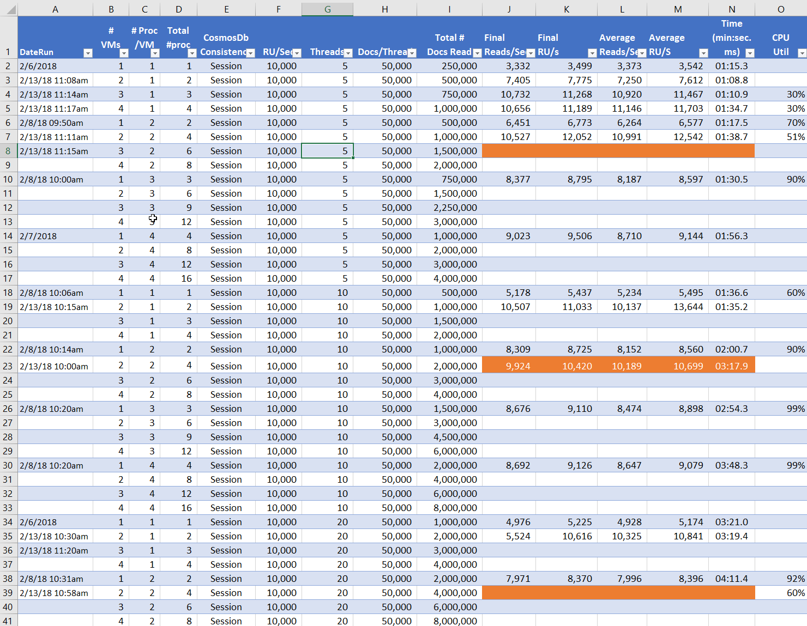
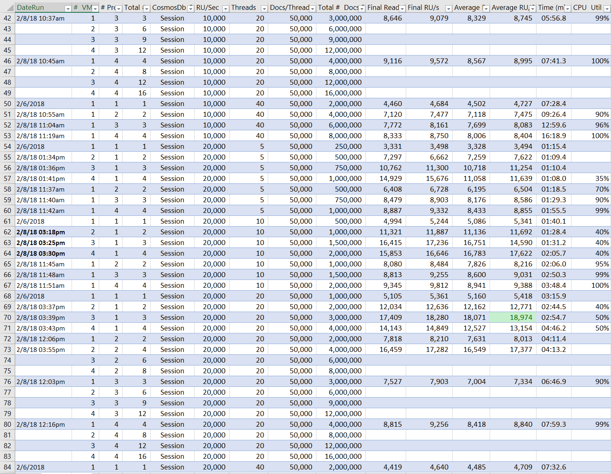
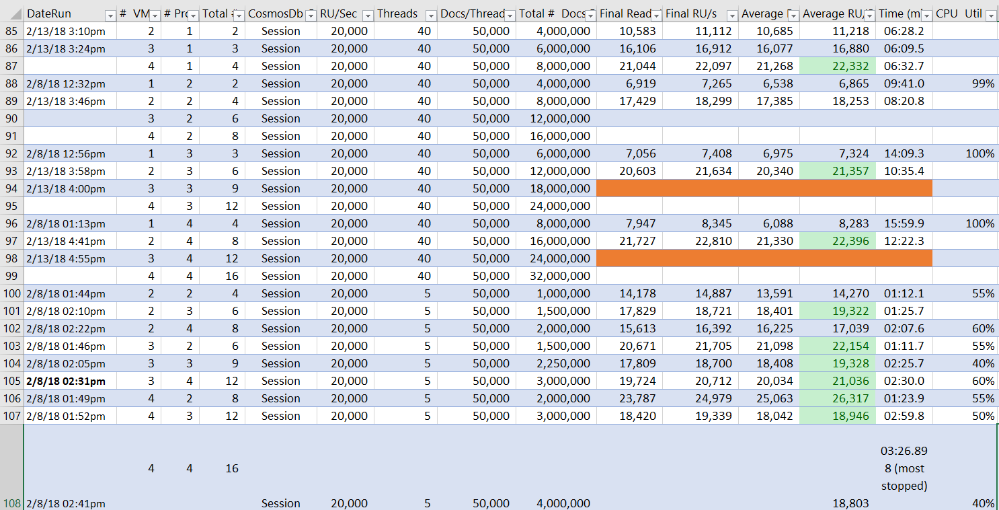
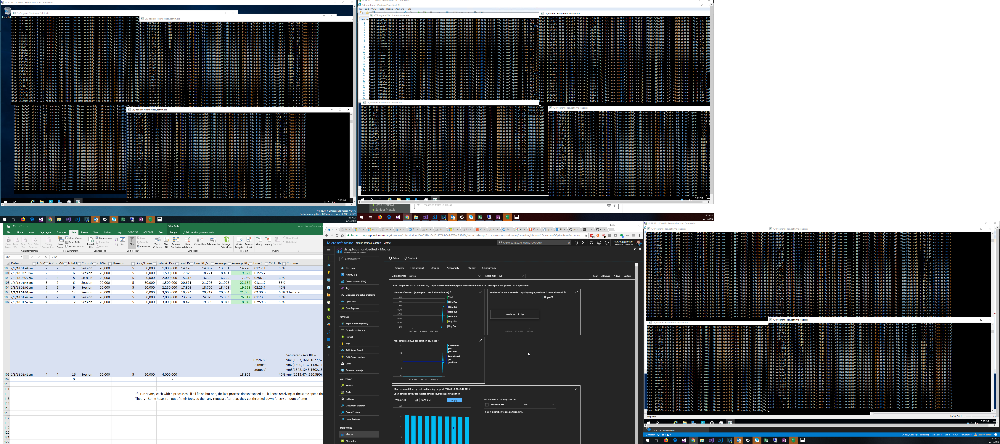
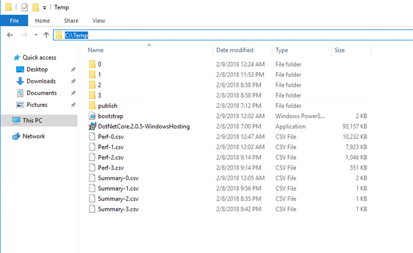
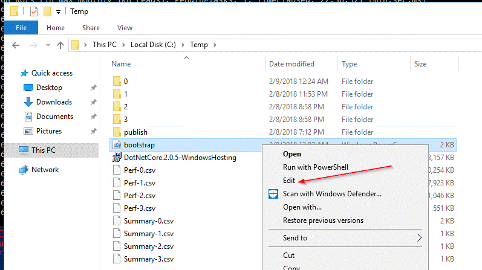
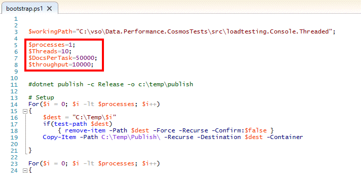
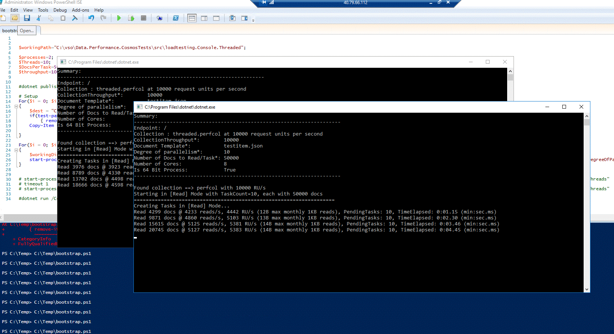

# CosmosDB Performance Tests

## Motivation
  * My company was seeing really bad performance when hosting .Net Core apps specifically in App Services vs VMs.
  * We executed a substantical amount of tests of the web core as illustrated in my analysis [ploegert/Performance.AspNetCore](https://github.com/ploegert/Performance.AspNetCore)
  * Having identified opportuntities for improvement in App Services, we were curious what was the maximum performance that we could attain from a simple command line utilize to saturate the available RUs from Cosmos.
  * I stumbled across this whilst splunking through the [CosmosDB Performance Docs](https://docs.microsoft.com/en-us/azure/cosmos-db/performance-testing).
  * The project here within ended up being a slight mutation of something microsoft created in github called [documentdb-benchmark](https://github.com/Azure/azure-documentdb-dotnet/blob/master/samples/documentdb-benchmark/Program.cs) from the [azure-documentdb-dotnet](https://github.com/Azure/azure-documentdb-dotnet) repo.

## Differences between my code & Microsoft's Reference Example
The main changes I implemented was (that I can remember):
  * Needed the project to be in Asp.Net Core 2.0
    - I've noticed performance differences between Asp.Net full framework vs Asp.Net Core - Where the performance numbers seem to be more favorable to asp.net over .net core (Suprise!) 
    - My extensive analysis of this is here: 
  * Added code to allow you to switch mode to either insert records or read records
  * Copied the project & ported it to be deployagble to a v2 azure function 

## Code Contained Within

Two projects exist in the solution:

#### loadtesting.Console.Threaded 

  * This is the main project you'll want to look at. 
  * It is based on .Net Core 2.0 & is the center of this test

#### loadtesting.function

  * This is a port of the loadtesting.Console.Threaded to make it capable of being executed in a Function so we could get an idea how it would perform in AppService
  * Spoiler Alert - It was actually pretty bad performaning. With 1 vm with 1 process, with 5 tasks trying to read 50,000 documents, it saw ~500RU's. The equivelent run as a console app achieved 3500 RU.

## Test Results (last updated 2/15/2018)

### Test Example Diagram

Illustrated in the below diagram would represent:
  * 2 vms each with 2 processes
  * Each thread from 1 to N would try to read 50,000 documents from CosmosDB
  * Each Process would have 1 long lived cosmos client that the treads would use to connect to Comsmos and therefore would have the same retry logic as configured by the process
  * I'm the dinosaur in this picture. Rawr.
 


### Test Parameters
  * Executed on a Azure Standard DS4v2 VM (not tested in App Service)
    * 8 core vm
    * 28 GB RAM 
    * SSD
  * CosmosDB Data Size is 1,000,000 documents with indexes equal to an integer from  [1..1,000,000]
  * Each document should have a random fields that follow the following schema:

    ```
    {
	    id=userID, (int 1-1mill)
	    ObjectType=user, (string 4)
	    userID, (string 16
	    userFirtstname, (string 64)
	    userLastName,  (string 64)
	    password,  (string 8)
	    JWT formatted token.  (100 byte rando)
    }
    ```

  * CosmosDB created 10 paritions
  * Reads against Comsos was generated by picking RandomInt(1,1000000) and searching for that that document

### Test Metric Definitions
| Column | ColumnName               | Description           |
| -------| ------------------------ |:----------------------|
| A      | Date Run                 | Date the test was executed |
| B      | # VMs                    | Total number of VMs used for the test |
| C      | # Proccess/VM            | Number of Processes exected on each VM |
| D      | Total # proc             | (=#vms*#processes) Totaly Number of Processes running acorss VMs |
| E      | CosmosDB Consistenecy    | The configured consistency level of CosmosDB |
| F      | RU/Sec                   | The configured total # allocation of Request Units/Sec Cosmos was configured for - 10,000 RU/s across 10 paritions means 1,000 RU/s Per Partiation) |
| G      | Treads                   | The number of Threads or Tasks executed by each Process |
| H      | Docs/Threads             | The number of Documents the test will try to read by each thread for each process within each vm | 
| I      | Total # Docs Read        | Total Number of Docs Read during duration of test across all VMs/Process/Threads |
| J      | Final Reads/Sec          | Last metric of **Reads/Sec** sumamrized across all VMs/Processes/Threads for duration of test |
| K      | Final RU/s               | Last metric of **RUs** (CosmosDB Request Units Consumed) sumamrized across all VMs/Processes/Threads for duration of test - Summarized over partitions |
| L      | Average Reads/Sec        | Average **Reads/Sec** used across all VMs/Processes/Threads for duration of test |
| M      | Average RU/s             | Average **RUs** (CosmosDB Request Units Consumed) summarized across all VMs/Processes/Threads for duration of test - Summarized over partitions |
| N      | (min:sec.ms)             | Total Time to execute all processes on all vms |
| O      | CPU Util                 | Observed rough CPU Utilization per vm |

### Test Results for Reads/Sec





## Observations/Weird Behavior
* The biggest "oddity" that was observed was that if say I had:
  * 3 vms configured 
  * Each VM has 4 processes
  * Each Process tries to read 50,000 docs as quickly as possible
  * Cosmos is configured for 10,000 RUs
* This test will saturate the available RUs
* What i have observed is: 
  * vm1 has all 4 processes connecting with > 1,000 RUs
  * vm2 will have ~2 processes with good speeds (> 1000 RUs) and ~2 processes with bad speeds (< 1000 RUs) 
  * vm3 will generally ahve bad speeds (< 1000 RUs)
  * The theory is, 
      * **Conjecture** If I were to kill all the the processes on VM1 & VM2 and all but one process on VM3, I should have only 1 process running with bad speeds
      * **Theorized Result** If i were to wait long enough, I'd think the number of RU's should go up.
      * **Observed Result** Nope. Just hangs out at really bad RU's for a super long time - many hours without changing. Check out the screenshot below:



## How to execute the Cosmos Tests Console App

First off, publish the build output to a publish folder. Then copy that folder to c:\Temp on the target box and you should see the files that are necessary to run this pig. 
 


Simply right click on “Bootstrap.ps1” & select Edit. This will open up The Windows Powershell ISE


 
On the top, you’ll seethe parameters you can play with - #Processes, Threads, Docs/Task, & throughput. Simply update this & press F5 to run it (or select the little run button). Note if you change the throughput, the script will prompt you telling you the throughput you specified doesn’t match whats currently configured. If you press any key, it will automatically change the throughput on Cosmos. After this, close down your processes & try again and it will all be normal



Once you run it (press F5), it should look something like this – where each new window is a “Process”



